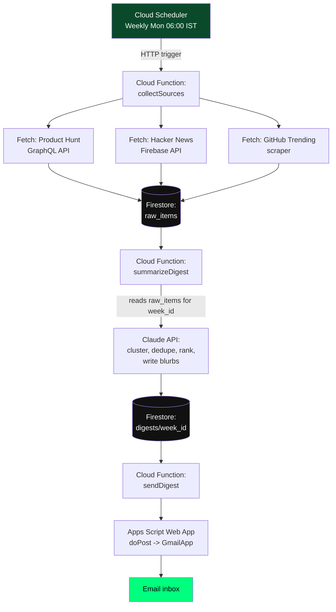
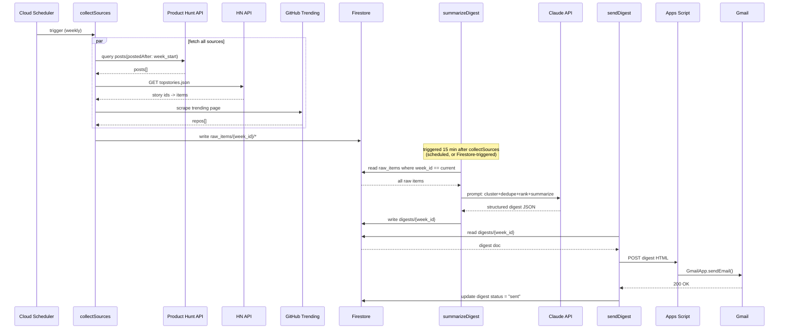

# PRD — AI Tool Trend Digest Pipeline
## Automated weekly research aggregator for content + product research

---

## 1. PROBLEM STATEMENT

Every week, sourcing "what's worth talking about" from Product Hunt, Hacker News,
and GitHub Trending manually takes 3-5 hours of scrolling, deduping, and
judgment calls. This system automates the collection + ranking step so a human
only reviews a short, pre-filtered digest and picks the week's focus (video +
possible build).

**Primary user (v1):** solo builder (you), digest delivered via email every
Monday morning.

**Future user (v2, optional):** public subscribers — same pipeline, multi-recipient
delivery, possibly a public web digest.

---

## 2. GOALS

- Eliminate manual scanning of PH / HN / GitHub every week
- Deduplicate the same story appearing across multiple sources
- Rank by genuine signal (velocity of votes/points, not just raw count)
- Produce a short, opinionated digest (not a raw feed) with a "why this matters
  to a builder" line per item
- Surface one explicit "pick of the week" as a content/build candidate
- Fully automated end-to-end except reading the final email

## 3. NON-GOALS (v1)

- No public-facing UI/dashboard (email only)
- No multi-user subscriber management
- No real-time alerts — weekly cadence only
- No payment/billing logic

---

## 4. USERS & JOURNEY

### 4.1 Primary journey (you, weekly)

1. Monday 6:00 AM IST — pipeline runs automatically (Cloud Scheduler trigger)
2. Pipeline fetches from all 3 sources, dedupes, ranks, summarizes via LLM
3. Digest email lands in inbox by ~6:15 AM
4. You read digest (5-10 min), pick the week's tool/topic
5. You proceed with Tue-Sat build/record/edit/publish cycle (separate,
   manual — outside this system's scope)

### 4.2 Failure journey

1. One source fails to fetch (e.g. GitHub Trending scraper breaks)
2. Pipeline logs the failure, continues with remaining sources
3. Digest email still sends, with a note: "GitHub Trending unavailable this
   week" — pipeline never silently fails to deliver

---

## 5. SYSTEM ARCHITECTURE



### 5.1 Component responsibilities

| Component | Responsibility | Failure handling |
|---|---|---|
| `collectSources` | Orchestrates 3 source fetches (parallel or sequential) | Per-source try/catch; missing source doesn't block others |
| Source fetchers | Pull raw data, normalize to common schema, write to Firestore | Retry once on transient error, then log + skip |
| `summarizeDigest` | Single LLM call: dedupe, cluster, rank, write digest | If LLM call fails, retry once; on second failure send raw top-10 fallback digest |
| `sendDigest` | Format digest as HTML, POST to Apps Script | Retry 3x with backoff; alert (log) on total failure |

---

## 6. DATA FLOW — WEEKLY SEQUENCE



---

## 7. DATA MODEL (Firestore)

### 7.1 `raw_items` collection

```ts
interface RawItem {
  id: string;                  // auto-generated doc id
  source: 'producthunt' | 'hackernews' | 'github';
  week_id: string;             // ISO week, e.g. "2026-W29"
  title: string;
  url: string;
  description: string;         // tagline / text / repo description
  score: number;                // votes / points / stars-this-week / upvotes
  comments_count: number;
  tags: string[];               // topics / flair / language
  fetched_at: Timestamp;
  raw: Record<string, any>;     // original payload for debugging
}
```

Path: `raw_items/{autoId}`
Indexed fields: `week_id`, `source`, `score` (composite index: `week_id` + `score desc`)

### 7.2 `digests` collection

```ts
interface DigestTopPick {
  title: string;
  url: string;
  source: string;
  category: string;             // e.g. "agent-infra", "vibe-coding-security", "MCP"
  why_it_matters: string;       // 1-2 sentence LLM-written blurb
  score: number;
}

interface Digest {
  week_id: string;
  generated_at: Timestamp;
  sent_at: Timestamp | null;
  status: 'draft' | 'sent' | 'failed';
  top_picks: DigestTopPick[];   // 5-8 items
  pick_of_the_week: DigestTopPick;
  full_summary: string;         // short narrative paragraph
  sources_status: {
    producthunt: 'ok' | 'failed';
    hackernews: 'ok' | 'failed';
    github: 'ok' | 'failed';
  };
}
```

Path: `digests/{week_id}`

### 7.3 `config` collection (single doc, runtime-tunable without redeploy)

```ts
interface Config {
  keyword_filters: string[];         // ["AI","agent","LLM","MCP", ...]
  recipient_emails: string[];
  min_score_thresholds: {
    producthunt: number;
    hackernews: number;
    github: number;
  };
}
```

Path: `config/pipeline`

---

## 8. SOURCE INTEGRATION SPECS

### 8.1 Product Hunt
- Endpoint: `POST https://api.producthunt.com/v2/api/graphql`
- Auth: `Authorization: Bearer <PH_DEVELOPER_TOKEN>` (non-expiring dev token,
  generated from producthunt.com/v2/oauth/applications)
- Query: `posts(postedAfter: <week_start_ISO>, order: VOTES, first: 50)`
- Rate limit: ~900 complexity points / 15 min window on client token — a weekly
  call is far under this

### 8.2 Hacker News
- Endpoint: `https://hacker-news.firebaseio.com/v0/topstories.json` +
  `https://hacker-news.firebaseio.com/v0/item/{id}.json`
- Auth: none
- Filter: title/text matched against `keyword_filters`, sorted by `score`

### 8.3 GitHub Trending
- No official API — scrape `github.com/trending?since=weekly` (or use a
  maintained unofficial wrapper library) filtered to relevant topics
  (`ai`, `llm`, `agent`, `developer-tools`)
- Most fragile source — isolated in its own try/catch, pipeline must not fail
  if this breaks

---

## 9. LLM SUMMARIZATION SPEC

**Model:** Claude Sonnet (via Anthropic API)
**Input:** all `raw_items` for `week_id`, serialized as compact JSON
**Task (system prompt intent):**
1. Cluster near-duplicate items across sources (same tool/story mentioned on
   PH + HN + GitHub = one entry, sources merged)
2. Drop pure noise / low-signal items
3. Rank remaining items by builder-relevance, not raw popularity
4. Write a 1-2 sentence "why this matters to a builder" per surviving item
5. Select exactly one `pick_of_the_week` with a short justification
6. Return strict JSON matching the `Digest` shape (no prose outside JSON)

**Output contract:** structured JSON only — parsed directly into the `digests`
document. If parsing fails, fallback path sends raw top-10-by-score items
without LLM commentary so the email never fails to deliver.

---

## 10. EMAIL DELIVERY SPEC

- `sendDigest` Cloud Function formats the `digests/{week_id}` doc into HTML
- POSTs JSON payload to a deployed Google Apps Script Web App URL
- Apps Script `doPost(e)` parses payload, calls `GmailApp.sendEmail()` to
  addresses in `config.recipient_emails`
- Gmail free-tier quota: 100 emails/day — no concern at this volume
- v2 upgrade path (if this becomes a public product): swap Apps Script for
  Firebase "Trigger Email" extension + SendGrid, no change needed elsewhere
  in the pipeline

---

## 11. SCHEDULING

- Cloud Scheduler job, cron `0 6 * * 1` (Monday 06:00), timezone `Asia/Kolkata`
- Triggers `collectSources` via authenticated HTTPS call
- `summarizeDigest` triggered either:
  - (a) by a second Cloud Scheduler job 15 min later, or
  - (b) by a Firestore `onWrite` trigger with a completion-check (all 3
    sources_status present) — cleaner but slightly more complex
  - **v1 recommendation: (a)**, simpler to build and debug

---

## 12. NON-FUNCTIONAL REQUIREMENTS

- **Cost target:** near-zero — Cloud Functions free tier + Firestore free
  tier + one Claude API call/week comfortably covers this
- **Reliability:** digest must send even if 1-2 sources fail
- **Observability:** every function logs to Cloud Logging; `sources_status`
  field in each digest doc gives at-a-glance weekly health
- **Security:** all API keys/tokens stored in Google Secret Manager, never
  hardcoded or committed

---

## 13. SUCCESS METRICS (v1)

- Digest arrives every Monday without manual intervention for 4 consecutive
  weeks
- Manual research time drops from ~3-5 hrs/week to <15 min review time
- At least one "pick of the week" per month directly becomes a video topic

---

## 14. FUTURE SCOPE (not in v1)

- Reddit as a 5th source — dropped from v1 due to friction setting up a
  script app (`reddit.com/prefs/apps`); revisit once core pipeline is proven
- Public web digest page
- Subscriber email list + unsubscribe flow
- Slack/Telegram delivery option
- Historical trend tracking (same tool appearing multiple weeks = rising signal)
- Turn into standalone SaaS product ("AI Tool Trend Digest for builders")

---

*PRD Version: 1.1.0 — Reddit removed from v1 scope*
*Owner: solo build*
